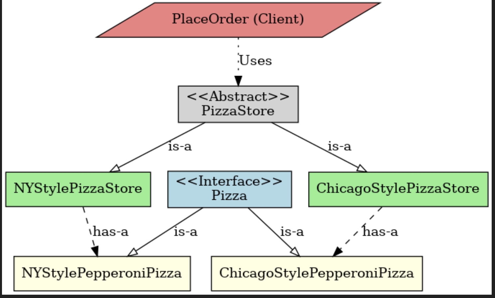

# 🏗️ Factory Method Design Pattern

## 📌 Overview
The **Factory Method Pattern** is a **creational design pattern** that defines an interface for creating objects in a superclass but allows subclasses to alter the type of objects that will be created. This pattern **delegates object creation** to subclasses, promoting **loose coupling** and **extensibility**.

---

## 🔥 **Why Use the Factory Method Pattern?**
1. ✅ **Encapsulation of Object Creation** – The client does not need to know which concrete class is being instantiated.
2. ✅ **Promotes Loose Coupling** – The client depends only on the abstract creator, making the code easier to maintain.
3. ✅ **Extensibility** – New object types can be added without modifying existing code.
4. ✅ **Encourages Open-Closed Principle** – The system is open for extension but closed for modification.

---

## 🎯 **Key Components**
1. **Product (`Interface or Abstract Class`)**  
   - Defines a common interface for the objects created by the factory method.
   
2. **Concrete Product (`Subclasses of Product`)**  
   - Implements the `Product` interface and defines specific behaviors.

3. **Creator (`Abstract Class with Factory Method`)**  
   - Declares the factory method which returns an object of type `Product`.  
   - May include a default implementation of the factory method.

4. **Concrete Creator (`Subclasses of Creator`)**  
   - Implements the factory method to instantiate specific concrete products.

---
