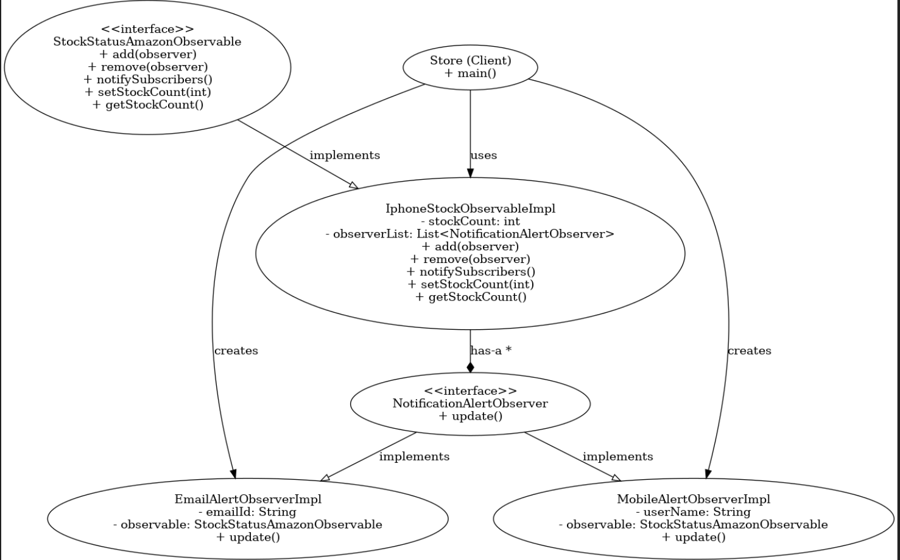

# Observer Design Pattern 👀

## 📌 Overview
The **Observer Pattern** is a behavioral design pattern where an object (**Subject/Observable**) maintains a list of its dependents (**Observers**) and notifies them automatically when its state changes.

This pattern allows for a **one-to-many** dependency where multiple objects (observers) react to changes in another object (subject) without being tightly coupled to it.

---

## 🎯 Key Concepts
- **Encapsulates dependencies** using the Subject-Observer relationship.
- **Uses composition (HAS-A relationship)** to store observers.
- **Promotes loose coupling** between Subject and Observers.
- **Ensures automatic updates** when the Subject’s state changes.

---

## 🛠️ UML Diagram
The following diagram illustrates the **Observer Pattern** implementation:



### 🏗️ **Class Relationships**
- **`StockStatusAmazonObservable`** (Subject) **HAS-A** list of `NotificationAlertObserver` (**Composition**).
- **`NotificationAlertObserver`** (Interface) is implemented by multiple **Concrete Observers**.
- Each observer **IS-A** `NotificationAlertObserver` (**Inheritance**).

---

## 🔔 Example Usage
```java
public class Store {
    public static void main(String[] args) {
        StockStatusAmazonObservable iphoneStockObservable = new IphoneStockObservableImpl();

        NotificationAlertObserver observer1 = new EmailAlertObserverImpl("praadsss@gmail.com", iphoneStockObservable);
        NotificationAlertObserver observer2 = new MobileAlertObserverImpl("Praddy", iphoneStockObservable);
        NotificationAlertObserver observer3 = new EmailAlertObserverImpl("pradsss@gmail.com", iphoneStockObservable);

        iphoneStockObservable.add(observer1);
        iphoneStockObservable.add(observer2);
        iphoneStockObservable.add(observer3);

        // Updating stock should notify all observers
        iphoneStockObservable.setStockCount(20);
    }
}
