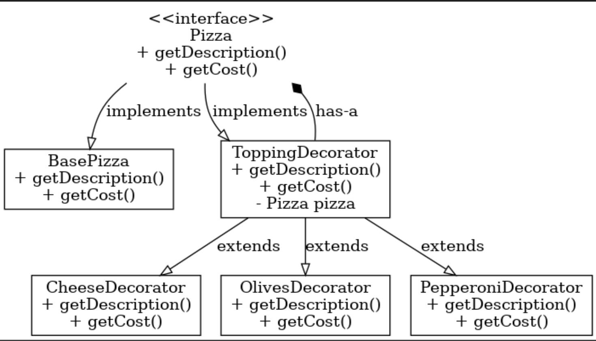
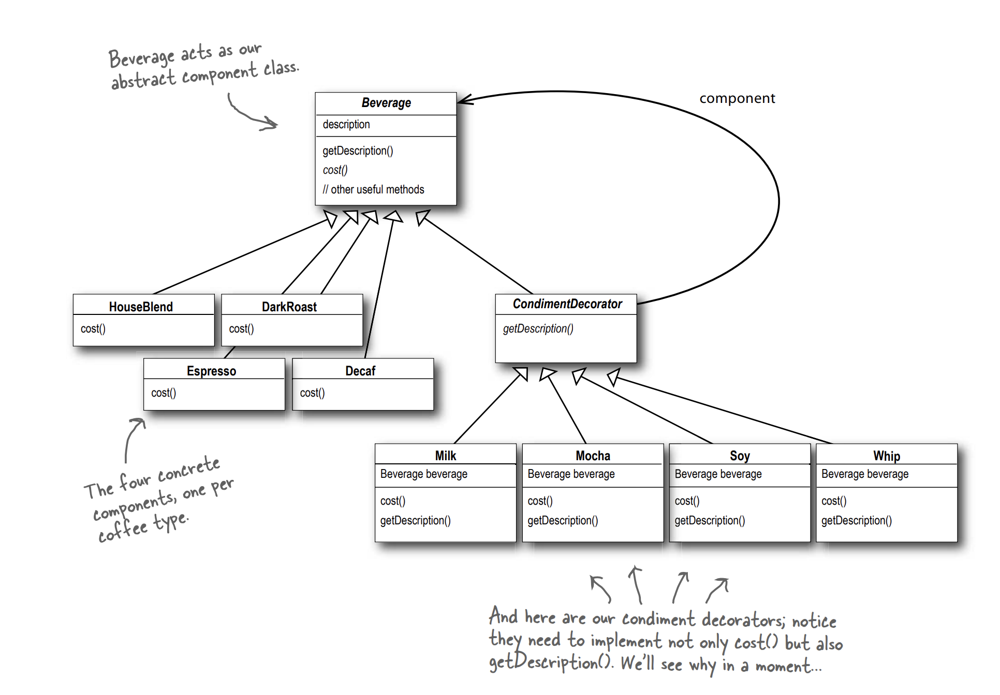

# Decorator Pattern 🍕
The **Decorator Pattern** is a structural design pattern that allows you to dynamically add behavior to an object without modifying its structure. It follows the **Open-Closed Principle** and is an alternative to subclassing.

## **1. Why Use the Decorator Pattern?**
- Avoids **class explosion** caused by excessive subclassing.
- Adds features to objects **at runtime** instead of compile-time.
- Promotes **composition over inheritance**.
- Keeps the base class **lightweight and reusable**.

## **2. UML Diagram**

## **3. Implementation Example: Pizza with Toppings**
### **Components**
- `Pizza` → **Interface (Component)**
- `BasePizza` → **Concrete Component**
- `ToppingDecorator` → **Abstract Decorator**
- `CheeseDecorator`, `OlivesDecorator`, `PepperoniDecorator` → **Concrete Decorators**

